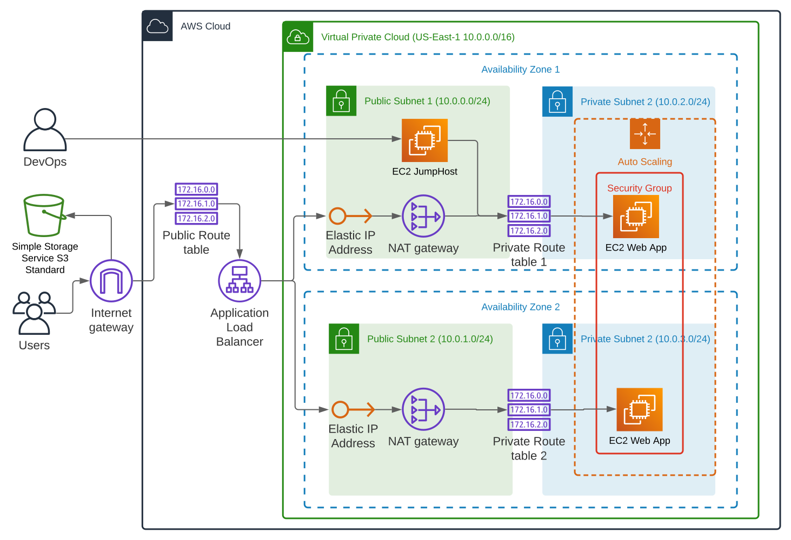

# Cloudformation High Availability Web App
This folder provides the starter code forthe "ND9991 - C2- Infrastructure as Code - Deploy a high-availability web app using CloudFormation" project. This folder contains the following files:

### Table of Contents

1. [Introduction](#intro)
2. [Project Details](#details)
3. [File Descriptions](#files)
4. [How To Run](#execution)
5. [Data Model](#model)
6. [Licensing, Authors, and Acknowledgements](#licensing)

## Introduction<a name="intro"></a>

This project is part of the Udacity Nanodegree "Cloud DevOps Engineer".
Goal is to apply the learned content about Infrastruce As Code (IAC) and AWS to develop a Cloudformation script that deploys a high availability web app.

## Project Details<a name="details"></a>

The deployment script creates the networking infrastructure as well as server infrastructure. The network infrastructure is build into a Virtual Private Network, which spreads over two Availability Zones containing each a Public Subnet and a Private Subnet. Two availability zones ensure high availability for the web app, even if one Availability Zone is down. The web app is served via EC2 instances in the private subnets. To allow the web app to scale elastically with higher inbound traffic, the EC2 instances serving the web app are placed into a EC2 Auto Scaling Group. An Internet Gateway allows incoming traffic on to be distributed to the different EC2 instances by the Elastic Load Balancer.

The web app architecture is depicted in the image below:




## File Descriptions <a name="files"></a>

Here you can see the files of the project with a short description:

```
cloudformation-high-availability-web-app/
│
├── README.md
├── app/ 
    ├── create.sh --> shell script to start a new deployment
    ├── update.sh --> shell script to update a running deployment
    ├── delete.sh --> shell script to delete a running deployment
    ├── network.yml --> YAML file which describes the network components to deploy the web app
    ├── network-parameters.json --> json file containing the parameters for the network 
    ├── server.yml --> YAML file which describes the servers components to deploy the web app
    ├── server-parameters.json --> json file containing the parameters for the servers 
├── images/
├── LICENSE


```
## How To Run<a name="execution"></a>

- Step 1: Install the AWS CLI Tool on your machine. You can check if installed properly with:
```
$ aws --version
```

- Step 2: Create an Access Key ID for IAM User with programmatic access via the AWS Console.

- Step 3: Configure AWS CLI Tool with newly created keys of user and set 

```
$ aws configure
```

- Step 4: Check if AWS CLI configuration works properly: 
```
$ aws iam list-users
```

- Step 5: Run the create-stack-set command:
```
aws cloudformation create-stack-set --stack-set-name my-stack-set --template-body file://stack1.yaml file://stack2.yaml
```

In this example, my-stack-set is the name of the StackSet you want to create, and stack1.yaml and stack2.yaml are the names of the CloudFormation templates for each stack.
Once you have created the StackSet, you can use the AWS CLI or the AWS Management Console to deploy the stacks in the accounts and regions you specify.


- Step 6: Check if web app was deployed properly.

## Results<a name="results"></a>

...


## Licensing, Authors, Acknowledgements<a name="licensing"></a>

Feel free to use my code as you please:

Copyright 2021 Leopold Walther

Permission is hereby granted, free of charge, to any person obtaining a copy of this software and associated documentation files (the "Software"), to deal in the Software without restriction, including without limitation the rights to use, copy, modify, merge, publish, distribute, sublicense, and/or sell copies of the Software, and to permit persons to whom the Software is furnished to do so, subject to the following conditions:

The above copyright notice and this permission notice shall be included in all copies or substantial portions of the Software.

THE SOFTWARE IS PROVIDED "AS IS", WITHOUT WARRANTY OF ANY KIND, EXPRESS OR IMPLIED, INCLUDING BUT NOT LIMITED TO THE WARRANTIES OF MERCHANTABILITY, FITNESS FOR A PARTICULAR PURPOSE AND NONINFRINGEMENT. IN NO EVENT SHALL THE AUTHORS OR COPYRIGHT HOLDERS BE LIABLE FOR ANY CLAIM, DAMAGES OR OTHER LIABILITY, WHETHER IN AN ACTION OF CONTRACT, TORT OR OTHERWISE, ARISING FROM, OUT OF OR IN CONNECTION WITH THE SOFTWARE OR THE USE OR OTHER DEALINGS IN THE SOFTWARE.